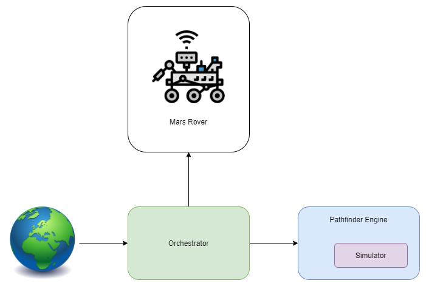
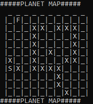
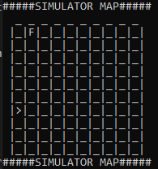
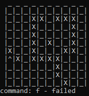

# mars-rover-exercise

## Problem
You’re part of the team that explores Mars by sending remotely controlled vehicles to the surface of the planet. Develop an API that translates the commands sent from earth to instructions that are understood by the rover.

Requirements
- You are given the initial starting point (x,y) of a rover and the direction (N,S,E,W) it is facing.
- The rover receives a character array of commands.
- Implement commands that move the rover forward/backward (f,b).
- Implement commands that turn the rover left/right (l,r).
- Implement wrapping from one edge of the grid to another. (planets are spheres after all)
- Implement obstacle detection before each move to a new square. If a given sequence of commands encounters an obstacle, the rover moves up to the last possible point, aborts the sequence and reports the obstacle.

## Architecture
The architecture is composed by four principal components:
- Earth: the executable project where we can also set the variables to configure the problem;
- Pathfinder engine: a class library that contains the core of the engine that calculate the path to shift the Mars Rover from its position to the defined finish;
- Rover: a class library that simulate the behaviour of Mars Rover;
- Orchestrator: a class library that, under the control of the Earth, orchestrate the communications between Pathfinder engine and the rover.

More in details the communication step are:
- Earth configures the Orchestrator and ask to its to drive the Mars Rover to the goal location;
- Orchestrator communicate with Pathfinder to receive the commands necessaries to achieve its task;
- Pathfinder use its Simulator to execute some simulation based on its knowledge about the planet and find a path to the goal;
- Orchestrator sends commands received from Pathfinder to the Mars Rover;
- Mars Rover try to execute all the commands received:
    - if it founds any obstacle it communicate to the Orchestrator its current position and orientation;
    - else it communicates to the Orchestrator that it has executed all commands and it has reached the goal location;
- Orchestrator, if the Mars Rover finds an obstacle, comunicates vehicle location and orientation to the Pathfinder engine to update the Simulator environment and start the research for a valid path again;
- Orchestrator continues these communications until the Pathfinder communicates that the problem is unsolvable or the Mars Rover reaches the finish point.

## How it works
All the configuration parameters are condensed in the *Program.cs* file inside the project *MarsExercise.Earth* that is the only one executable project inside the Solution.
They are:
- *movementTimeout* to define the sleep period that have to perform the Mars Rover after each command execution (in milliseconds);
- *planetXsize* and *planetYsize* to determine the planet boundaries;
- *GetPlanet* method to set the planet obstacles;
- *start* to define vehicle starting point;
- *orientation* to specify the initial vehicle orientation;
- *finish* to define vehicle goal location.

During the execution the application will show different log info:
- the initial planet map;

- the simulator planet map every time it receives a new request from the Orchestrator;

- the list of commands received by the Mars Rovers with a counter to identify the current iteration;

- the Mars Rover map after the execution of every command with the information about the command itself and the result (success/failed);

- the final result received by the Earth (Goal reached/Goal not reachable).

## Next step
There are some possible improvements like:
- separate the principal components in different applications to better simulate the interactions;
- implement a better interactive visualization (es. web page with WebSocket) of the Mars Rover movements to make its actions more clear;
- develop a feature to permit the configuration of start and finish location and the obstacles on the planet through a visual tool;
- base the communication between the orchestrator and the Mars Rover on queue services to decoupling the activities and obtain more resilience.